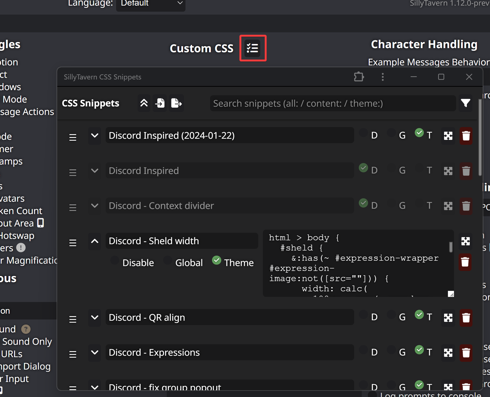

# CSS 代码片段

添加一个用户界面来管理自定义 CSS 代码片段。

代码片段可以全局激活，链接到特定主题，或链接到特定聊天（角色/群组）。

## 安装

使用 ST 内置的扩展安装器，使用此 URL：  
https://github.com/LenAnderson/SillyTavern-CssSnippets/

## 使用方法

打开**用户设置**并点击**自定义 CSS** 旁边的按钮

## 依赖项

（*可选*）仅在您想要在外部编辑器中编辑代码片段时需要

- 扩展：[Files Plugin API](https://github.com/LenAnderson/SillyTavern-FilesPluginApi)
- 服务器插件：[Files Plugin](https://github.com/LenAnderson/SillyTavern-Files)
